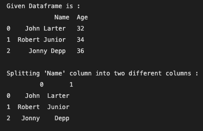
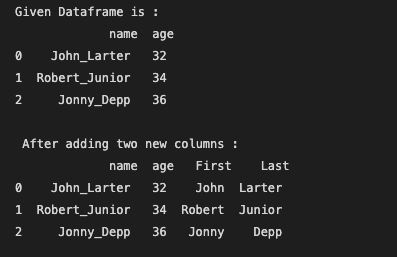

# Split a text column into two columns in Pandas DataFrame

## :label: Using Series.str.split() functions

```python
df = pd.DataFrame({'name': ['John Larter', 'Robert Junior', 'Jonny Depp'],
                   'age':[32, 34, 36]})
   
print("Given Dataframe is :\n",df)
   
# bydefault splitting is done on the basis of single space.
print("\nSplitting 'Name' column into two different columns :\n",
                                  df.name.str.split(expand=True))
```

The output is 

{ width="500" }

Split Name column into “First” and “Last” column respectively and add it to the existing Dataframe.

```python
# create a new data frame
df = pd.DataFrame({'name': ['John_Larter', 'Robert_Junior', 'Jonny_Depp'],
                    'age':[32, 34, 36]})
   
print("Given Dataframe is :\n",df)
   
# Adding two new columns to the existing dataframe.
# bydefault splitting is done on the basis of '_'.
df[['First','Last']] = df.name.str.split('-', expand=True)
   
print("\n After adding two new columns : \n", df)
```
The output is 

{width="500"}