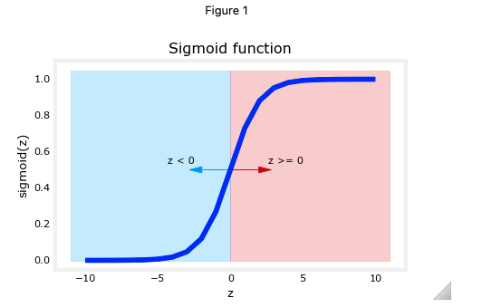

# Logistic Regression

## :label: Formula for Sigmoid function

The formula for a sigmoid function is as follows -  

$$g(z) = \frac{1}{1+e^{-z}}\tag{1}$$

In the case of logistic regression, z (the input to the sigmoid function), is the output of a linear regression model, namely $z= \mathbf{w} \cdot  \mathbf{x}^{(i)} + b$. 

* In the case of a single example, $z$ is scalar.
* In the case of multiple examples, $z$ may be a vector consisting of $m$ values, one for each example. 
* The implementation of the sigmoid function should cover both of these potential input formats.
Let's implement this in Python.

NumPy has a function called [ `exp()` ](https://numpy.org/doc/stable/reference/generated/numpy.exp.html), which offers a convenient way to calculate the exponential ( $e^{z}$) of all elements in the input array ( `z` ). It also works with a single number as an input, as shown below.

The `sigmoid` function is implemented in python as shown in the cell below.

```python
def sigmoid(z):
    """
    Compute the sigmoid of z

    Args:
        z (ndarray): A scalar, numpy array of any size.

    Returns:
        g (ndarray): sigmoid(z), with the same shape as z
         
    """

    g = 1/(1+np.exp(-z))
   
    return g
```

As you can see, the sigmoid function approaches `0` as `z` goes to large negative values and approaches `1` as `z` goes to large positive values.



## :label: Logistic Regression

A logistic regression model applies the sigmoid to the familiar linear regression model as shown below:

$$ f_{\mathbf{w}, b}(\mathbf{x}^{(i)}) = g(\mathbf{w} \cdot \mathbf{x}^{(i)} + b ) \tag{2} $$ 

  where

  $$g(z) = \frac{1}{1+e^{-z}}\tag{3}$$

