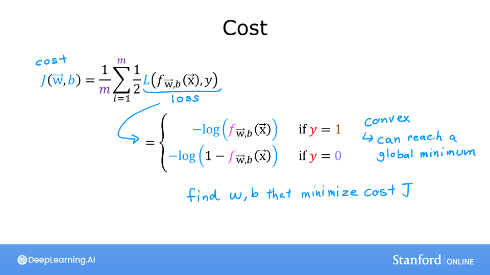
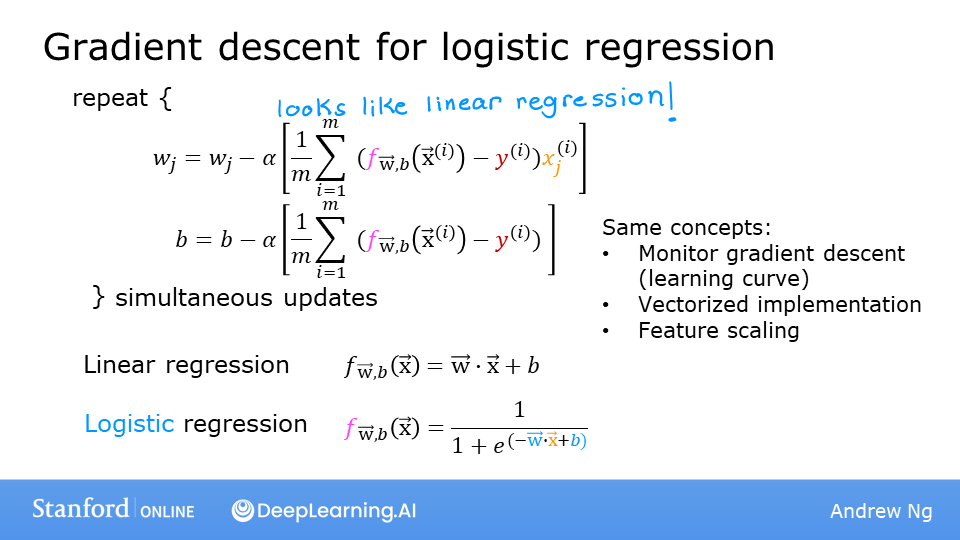

# Logistic Regression

## :label: Formula for Sigmoid function

The formula for a sigmoid function is as follows -  

$$g(z) = \frac{1}{1+e^{-z}}\tag{1}$$

In the case of logistic regression, z (the input to the sigmoid function), is the output of a linear regression model, namely $z= \mathbf{w} \cdot  \mathbf{x}^{(i)} + b$. 

* In the case of a single example, $z$ is scalar.
* In the case of multiple examples, $z$ may be a vector consisting of $m$ values, one for each example. 
* The implementation of the sigmoid function should cover both of these potential input formats.
Let's implement this in Python.

NumPy has a function called [ `exp()` ](https://numpy.org/doc/stable/reference/generated/numpy.exp.html), which offers a convenient way to calculate the exponential ( $e^{z}$) of all elements in the input array ( `z` ). It also works with a single number as an input, as shown below.

The `sigmoid` function is implemented in python as shown in the cell below.

```python
def sigmoid(z):
    """
    Compute the sigmoid of z

    Args:
        z (ndarray): A scalar, numpy array of any size.

    Returns:
        g (ndarray): sigmoid(z), with the same shape as z
         
    """

    g = 1/(1+np.exp(-z))
   
    return g
```

As you can see, the sigmoid function approaches `0` as `z` goes to large negative values and approaches `1` as `z` goes to large positive values.


## :label: Logistic Regression

A logistic regression model applies the sigmoid to the familiar linear regression model as shown below:

$$ f_{\mathbf{w}, b}(\mathbf{x}^{(i)}) = g(\mathbf{w} \cdot \mathbf{x}^{(i)} + b ) \tag{2} $$ 

  where

  $$g(z) = \frac{1}{1+e^{-z}}\tag{3}$$

* As you can see, $g(z) >= 0.5$ for $z >=0$

* For a logistic regression model, $z = \mathbf{w} \cdot \mathbf{x} + b$. Therefore, 

  if $\mathbf{w} \cdot \mathbf{x} + b >= 0$, the model predicts $y=1$
  
  if $\mathbf{w} \cdot \mathbf{x} + b < 0$, the model predicts $y=0$

## :label: Plotting decision boundary

Now, let's go back to our example to understand how the logistic regression model is making predictions.

* Our logistic regression model has the form

  $f(\mathbf{x}) = g(-3 + x_0+x_1)$

* From what you've learnt above, you can see that this model predicts $y=1$ if $-3 + x_0+x_1 >= 0$

Let's see what this looks like graphically. We'll start by plotting $-3 + x_0+x_1 = 0$, which is equivalent to $x_1 = 3 - x_0$.


* In the plot above, the blue line represents the line $x_0 + x_1 - 3 = 0$ and it should intersect the x1 axis at 3 (if we set $x_1$ = 3, $x_0$ = 0) and the x0 axis at 3 (if we set $x_1$ = 0, $x_0$ = 3). 

* The shaded region represents $-3 + x_0+x_1 < 0$. The region above the line is $-3 + x_0+x_1 > 0$.

* Any point in the shaded region (under the line) is classified as $y=0$.  Any point on or above the line is classified as $y=1$. This line is known as the "decision boundary".

As we've seen in the lectures, by using higher order polynomial terms (eg: $f(x) = g( x_0^2 + x_1 -1)$, we can come up with more complex non-linear boundaries.

## :label: Cost(Loss) function

 Recall that loss is defined to apply to one example. Here you combine the losses to form the **cost**, which includes all the examples.

Recall that for logistic regression, the cost function is of the form 

$$ J(\mathbf{w}, b) = \frac{1}{m} \sum_{i=0}^{m-1} \left[ loss(f_{\mathbf{w}, b}(\mathbf{x}^{(i)}), y^{(i)}) \right] \tag{1}$$

where

* $loss(f_{\mathbf{w}, b}(\mathbf{x}^{(i)}), y^{(i)})$ is the cost for a single data point, which is:
    $$loss(f_{\mathbf{w},b}(\mathbf{x}^{(i)}), y^{(i)}) = -y^{(i)} \log\left(f_{\mathbf{w},b}\left( \mathbf{x}^{(i)} \right) \right) - \left( 1 - y^{(i)}\right) \log \left( 1 - f_{\mathbf{w},b}\left( \mathbf{x}^{(i)} \right) \right) \tag{2}$$
    

*  where m is the number of training examples in the data set and:
  
$$
\begin{align}
    f_{\mathbf{w},b}(\mathbf{x^{(i)}}) &= g(z^{(i)})\tag{3} \\
    z^{(i)} &= \mathbf{w} \cdot \mathbf{x}^{(i)}+ b\tag{4} \\
    g(z^{(i)}) &= \frac{1}{1+e^{-z^{(i)}}}\tag{5} 
\end{align}
$$


As in the below figure, $f$ is the output of logistic regression, thus $f$is always between 0 and 1 and vertical axis is the loss for different value of $f$. If the predicted probability $f$ is close to 1, the true lable is 1, then the loss is very small, pretty much close to 0, because you close to the right answer of the true label being 1. If the algorithm predicts 0.5, which is a bit higher but not that high. Whereas in contrast, if the algorithm were to have outputs at 0.1, it thinks that only a 10 percent change of the tumor being malignant but $y$ really is 1(malignant), then the loss is much higher value. 


The below figure is for the case of $y$ is 0. When $f$ is 0 or very close to 0, the loss is also going to be 0 or very small value which means that if the true label is 0 and the model's prediction is very close to 0, so it predicts right. The larger the value of $f$ gets, the bigger the loss because the prediction is further from the true label 0. In fact, as that prediction approaches 1, the loss actually approaches infinity value. In summary, **the further prediction $f_{\mathbf{w},b}(\mathbf{x^{(i)}})$ is from target $y^{(i)}$, the higher the loss.** 


## :label: Logistic Gradient Descent

Recall the gradient descent algorithm utilizes the gradient calculation:

$$\begin{align*}
&\text{repeat until convergence:} \; \lbrace \\
&  \; \; \;w_j = w_j -  \alpha \frac{\partial J(\mathbf{w},b)}{\partial w_j} \tag{1}  \; & \text{for j := 0..n-1} \\ 
&  \; \; \;  \; \;b = b -  \alpha \frac{\partial J(\mathbf{w},b)}{\partial b} \\
&\rbrace
\end{align*}$$

Where each iteration performs simultaneous updates on $w_j$ for all $j$, where

$$\begin{align*}
\frac{\partial J(\mathbf{w},b)}{\partial w_j}  &= \frac{1}{m} \sum\limits_{i = 0}^{m-1} (f_{\mathbf{w},b}(\mathbf{x}^{(i)}) - y^{(i)})x_{j}^{(i)} \tag{2} \\
\frac{\partial J(\mathbf{w},b)}{\partial b}  &= \frac{1}{m} \sum\limits_{i = 0}^{m-1} (f_{\mathbf{w},b}(\mathbf{x}^{(i)}) - y^{(i)}) \tag{3} 
\end{align*}$$

* m is the number of training examples in the data set      
* $f_{\mathbf{w},b}(x^{(i)})$ is the model's prediction, while $y^{(i)}$ is the target
* For a logistic regression model  
    $z = \mathbf{w} \cdot \mathbf{x} + b$  
    $f_{\mathbf{w},b}(x) = g(z)$  
    where $g(z)$ is the sigmoid function:  
    $g(z) = \frac{1}{1+e^{-z}}$   


