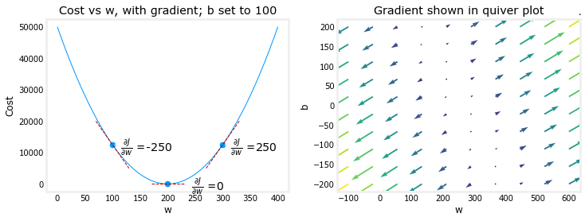
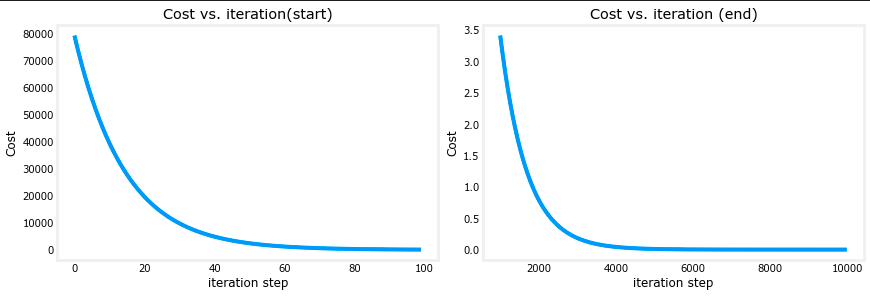
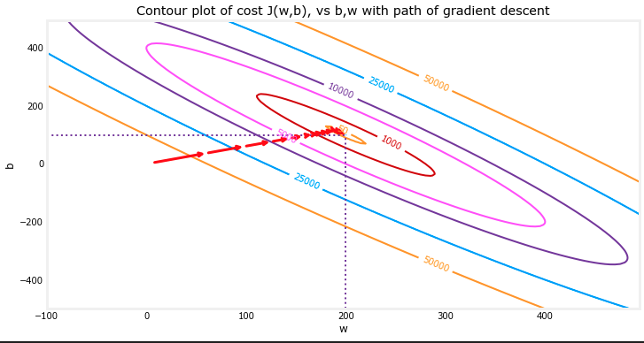
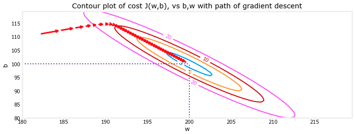

# Gradient Descent for Linear Regression

## Gradient descent summary

A linear model that predicts $f_{w, b}(x^{(i)})$:

$$f_{w, b}(x^{(i)}) = wx^{(i)} + b \tag{1}$$

In linear regression, you utilize input training data to fit the parameters $w$, $b$ by minimizing a measure of the error between our predictions $f_{w, b}(x^{(i)})$ and the actual data $y^{(i)}$. The measure is called the $cost$, $J(w, b)$. In training, you measure the cost over all of our training samples $(x^{(i)}, y^{(i)})$

$$J(w, b) = \frac{1}{2m} \sum\limits_{i = 0}^{m-1} (f_{w, b}(x^{(i)}) - y^{(i)})^2\tag{2}$$ 

*gradient descent* was described as:

$$\begin{align*} \text{repeat}&\text{ until convergence:} \; \lbrace \newline
\; w &= w -  \alpha \frac{\partial J(w, b)}{\partial w} \tag{3}  \; \newline 
 b &= b -  \alpha \frac{\partial J(w, b)}{\partial b}  \newline \rbrace
\end{align*}$$

where, parameters $w$, $b$ are updated simultaneously.  
The gradient is defined as:

$$
\begin{align}
\frac{\partial J(w, b)}{\partial w}  &= \frac{1}{m} \sum\limits_{i = 0}^{m-1} (f_{w, b}(x^{(i)}) - y^{(i)})x^{(i)} \tag{4}\\
  \frac{\partial J(w, b)}{\partial b}  &= \frac{1}{m} \sum\limits_{i = 0}^{m-1} (f_{w, b}(x^{(i)}) - y^{(i)}) \tag{5}\\
\end{align}
$$

Here *simultaniously* means that you calculate the partial derivatives for all the parameters before updating any of the parameters.

### compute_gradient

`compute_gradient` implements (4) and (5) above and returns $\frac{\partial J(w, b)}{\partial w}$, $\frac{\partial J(w, b)}{\partial b}$. The embedded comments describe the operations.

```python
def compute_gradient(x, y, w, b): 
    """
    Computes the gradient for linear regression 
    Args:
      x (ndarray (m,)): Data, m examples 
      y (ndarray (m,)): target values
      w,b (scalar)    : model parameters  
    Returns
      dj_dw (scalar): The gradient of the cost w.r.t. the parameters w
      dj_db (scalar): The gradient of the cost w.r.t. the parameter b     
     """
    
    # Number of training examples
    m = x.shape[0]    
    dj_dw = 0
    dj_db = 0
    
    for i in range(m):  
        f_wb = w * x[i] + b 
        dj_dw_i = (f_wb - y[i]) * x[i] 
        dj_db_i = f_wb - y[i] 
        dj_db += dj_db_i
        dj_dw += dj_dw_i 
    dj_dw = dj_dw / m 
    dj_db = dj_db / m 
        
    return dj_dw, dj_db
```



Above, the left plot shows $\frac{\partial J(w, b)}{\partial w}$ or the slope of the cost curve relative to $w$ at three points. On the right side of the plot, the derivative is positive, while on the left it is negative. Due to the 'bowl shape', the derivatives will always lead gradient descent toward the bottom where the gradient is zero.
 
The left plot has fixed $b=100$. Gradient descent will utilize both $\frac{\partial J(w, b)}{\partial w}$ and $\frac{\partial J(w, b)}{\partial b}$ to update parameters. The 'quiver plot' on the right provides a means of viewing the gradient of both parameters. The arrow sizes reflect the magnitude of the gradient at that point. The direction and slope of the arrow reflects the ratio of $\frac{\partial J(w, b)}{\partial w}$ and $\frac{\partial J(w, b)}{\partial b}$ at that point.
Note that the gradient points *away* from the minimum. Review equation (3) above. The scaled gradient is *subtracted* from the current value of $w$ or $b$. This moves the parameter in a direction that will reduce cost.

### Cost versus iterations of gradient descent 

A plot of cost versus iterations is a useful measure of progress in gradient descent. Cost should always decrease in successful runs. The change in cost is so rapid initially, it is useful to plot the initial decent on a different scale than the final descent. In the plots below, note the scale of cost on the axes and the iteration step.



### Contour plot of const J(w, b) versus b, w with path of gradient descent

the contour plot shows the $cost(w, b)$ over a range of $w$ and $b$. Cost levels are represented by the rings. Overlayed, using red arrows, is the path of gradient descent. Here are some things to note:

* The path makes steady (monotonic) progress toward its goal.
* initial steps are much larger than the steps near the goal.



**Zooming in**, we can see that final steps of gradient descent. Note the distance between steps shrinks as the gradient approaches zero.



!!! info "Reference"
    - :ledger: [Coursera:Supervised Machine Learning](https://www.coursera.org/learn/machine-learning/ungradedLab/lE1al/optional-lab-gradient-descent)
   
