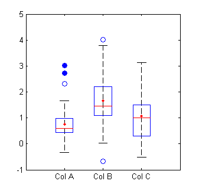

# Ways to identify outliers

**Outliers** are extreme values that differ from most other data points in a dataset. They can have a big impact on your statistical analyses and skew the results of any hypothesis tests. **True outliers** should always be retained in your dataset because these just represent natural variations in your sample.

## :label: Sorting method

You can sort quantitative variables from low to high in ascending order and find out extremely low or extremely high values. Flag any extreme values that you find. This is a simple way to check whether you need to investigate certain data points before using more sophisticated methods.

## :label: Data visualizations

Two of the most common graphical ways of detecting outliers are the boxplot and the scatterplot. A boxplot is my favorite way.

You can see here that the blue circles are outliers, where the open circles representing mild outliers, and closed circles representing extreme outliers:

## :label: Statistical outlier detection

Statistical outlier detection involves applying statistical tests or procedures to identify extreme values. You can convert extreme data points into z scores that tell you how many standard deviations away they are from the mean. If a value has a high enough or low enough z score, it can be considered an outlier. As a rule of thumb, values with a z score greater than **3 or less than –3** are often determined to be outliers1.

## :label: Using the interquartile range(IQR)

We can use the IQR method of identifying outliers to set up a “fence” outside of Q1 and Q3. Any values that fall outside of this fence are considered outliers.

Interquartile range method:

1. Sort your data from low to high
2. Identify the first quartile (Q1), the median, and the third quartile (Q3).
3. Calculate your IQR = Q3 – Q1
4. Calculate your upper fence = Q3 + (1.5 * IQR)
5. Calculate your lower fence = Q1 – (1.5 * IQR)
6. Use your fences to highlight any outliers, all values that fall outside your fences.

Your outliers are any values greater than your upper fence or less than your lower fence.

!!! info "Reference"
    * :ledger: [How to Find Outliers](https://www.scribbr.com/statistics/outliers/)
    * :ledger: [https://cxl.com/blog/outliers/](https://cxl.com/blog/outliers/)