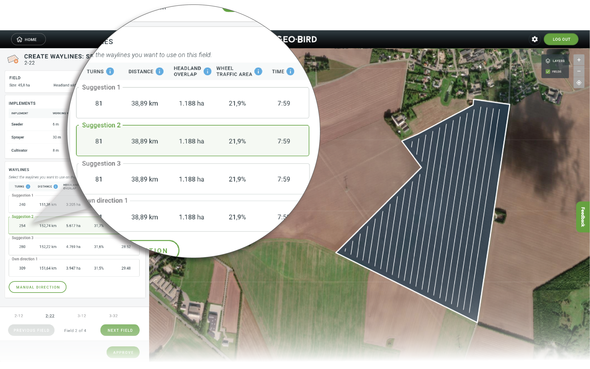
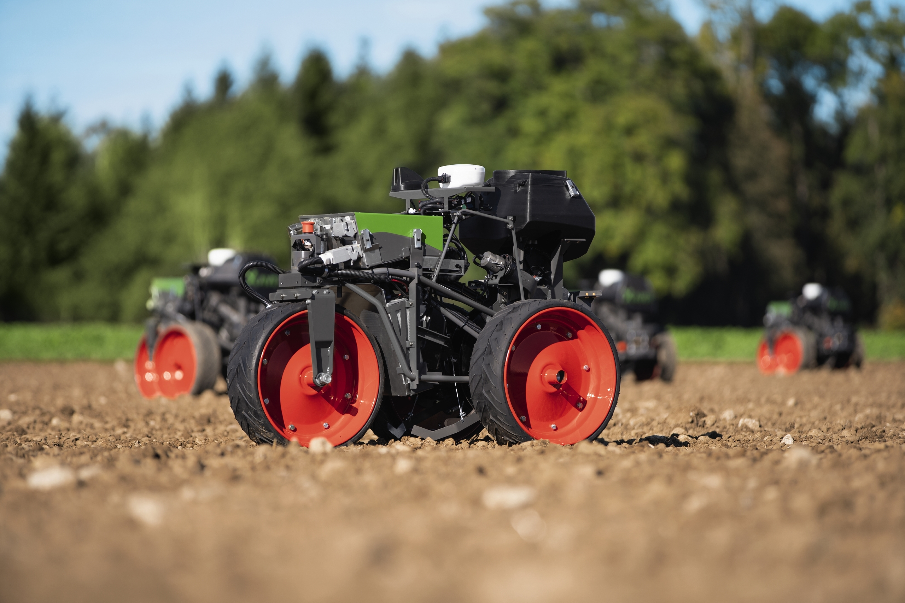

# Welcome to my personal website

Currently, I am working as an optimisation engineer in [AGCO](https://www.agcocorp.com) Randers Innovation Center since the year 2018. I received my PhD from Aarhus University, the research [group of Operations Management](https://ece.au.dk/en/research/key-areas-in-research-and-development/communication-control-and-automation/operations-management) in 2015.
My research focuses on the following topics:

- Operations planning: mission planning, task scheduling and allocation

- Field logistics: scheduling, area coverage planning, routing for machines and robots

- Information engineering: Identifying relevant data sources for business needs, data processing, decision optimisation

 Route and path planning algorithms that I developed have been applied to the following AGCO products:

- [Geo-Bird](https://app.geo-bird.com) is an easy-to-use web application focusing on optimizing farming and reducing costs while at the same time improving the CO2 footprint, it is not just your tool for wayline creation but also analyses your field and optimizes the waylines for Controlled Traffic Farming(CTF) to reduce wheel traffic, time and soil compaction.I am responsible for the wayline planning and optimal wayline direction algorithms.

<!--  -->

<figure markdown>
  { width="700" }
  <figcaption>(photos courtesy AGCO/Fuse)</figcaption>
</figure>

- [FendtONE Offboard](https://www.fendt.com/int/7-fendtone-offboard) complements the FendtONE onboard on the machine with practical, additional functions. For example, Fendt Task Doc, which records agronomy data/yield figures during field work (onboard), has been expanded with job planning and administration functions in Fendt Task Doc (offboard). My wayline planning algorithm is intergated in the system.

<figure markdown>
  { width="700" }
  <figcaption>(photos courtesy AGCO/Fendt)</figcaption>
</figure>

- [Fendt Xaver](https://www.fendt.com/int/xaver) is a compact, electric-powered prototype that’s designed to work autonomously in swarms in a field, with the aim of reducing soil compaction, energy consumption, and labour costs. My path and route planning algorithms is integated as a module of the entire robot system.
<!--  -->
<figure markdown>
  { width="700" }
  <figcaption>(photos courtesy AGCO/Fendt)</figcaption>
</figure>

<!-- 

<iframe width="1280" height="800" src="https://www.youtube.com/embed/OoUGSb-ASTc" title="YouTube video player" frameborder="0" allow="accelerometer; autoplay; clipboard-write; encrypted-media; gyroscope; picture-in-picture" allowfullscreen></iframe>

 -->
